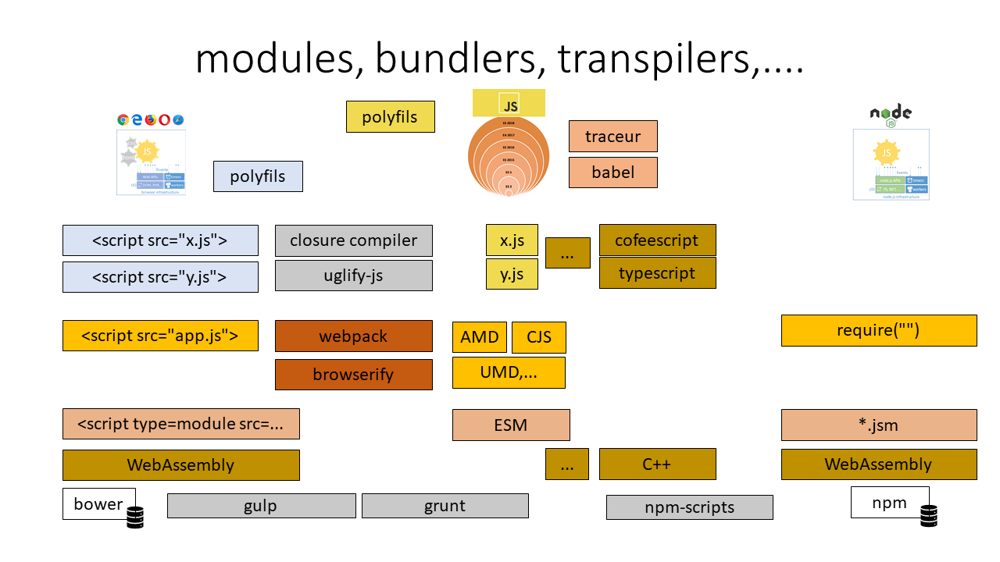
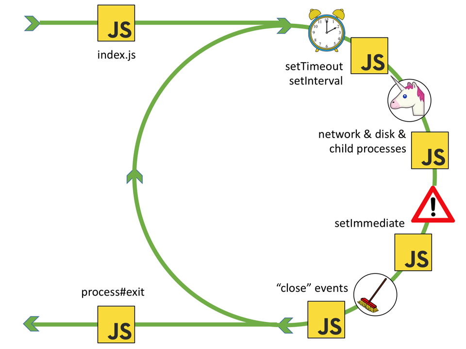
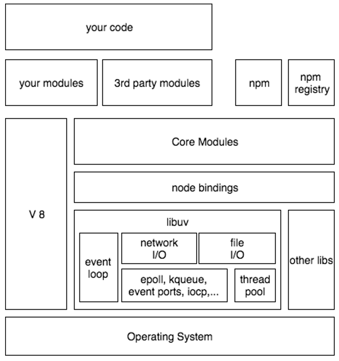
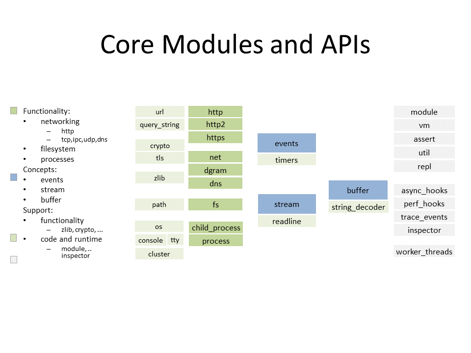
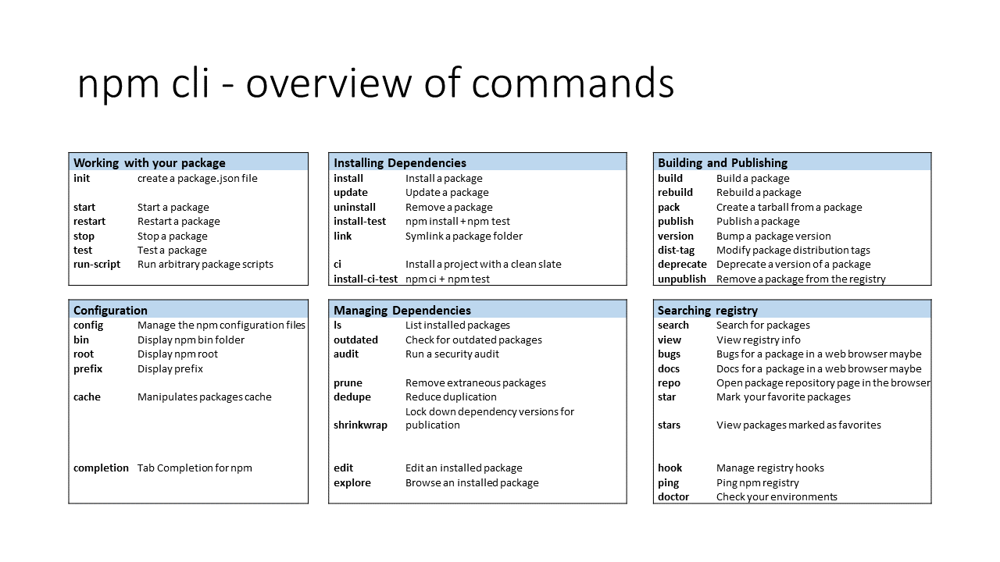

# Platforma & node a npm

Ako sa volá JS runtime s najnovšou verziou Javy?
- Neexistuje (s VS8 je nashorn, rhino a ďalšie pre staršie verzie...)

Čo to je traceur?
- Traceur is a JavaScript.next-to-JavaScript-of-today compiler.



Kde sá alokované všetky JS objekty?
- Heap je vo V8 (okrem bufferov, node ma na ne vlastny heap)

Event loop
- stack, program, node, lib uv, queue, stack...



## node.js



## npm versioning
```
MAJOR.MINOR.PATCH
  1  .  0  .  4 
  -- releases --
  *  .  ^  .  ~ 
  x  . 1.x . 1.0.x
```

Ktorá verzia sa na základe špecifikácie **~10.1.7** nainštaluje?
- 10.1.8
- 10.2.3
- 11.7.5

## npm commands



Ktory z commandov sluzi na .....?
- npm start
- npm stop
- npm restart
- npm run
- npm ls
- npm install