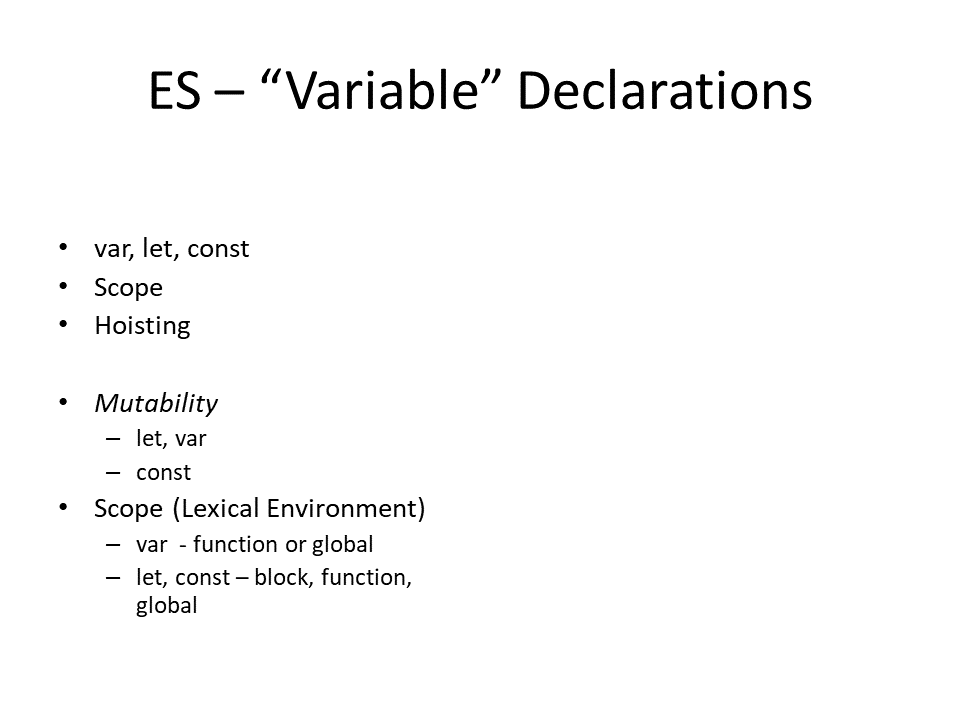

# Jazyk

- statements
- functions
- objects

## data types

## data structures

## coercion

### toString

### toNumber

### toBoolean

## variable declaration & scoping

## equality

|                   |                              |
|-------------------|------------------------------|
| `a == b`          | Abstract Equality Comparison |
| `a === b`         | Strict Equality Comparison   |
| `Object.is(a, b)` | SameValue                    |
| `[a].includes(b)` | SameValueZero                |

https://developer.mozilla.org/en-US/docs/Web/JavaScript/Equality_comparisons_and_sameness

## ~~language evolution~~

- **ES 5. 5.1 (2009, 2011)**
  - Array functions (filter, map, reduce,...)
- **ES 2015 (6th)**
  - Promise, Generators
  - Arrow functions
- **ES 2017 (8th)**
  - Async Functions, await operator
- **ES 2018 (9th)**
  - Promise.prototype.finally()
