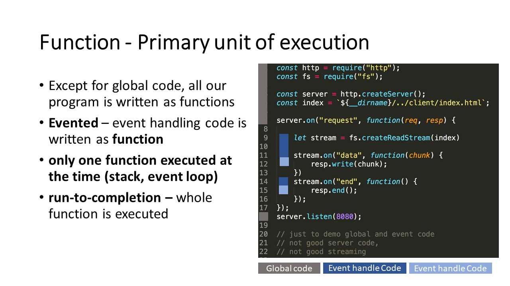
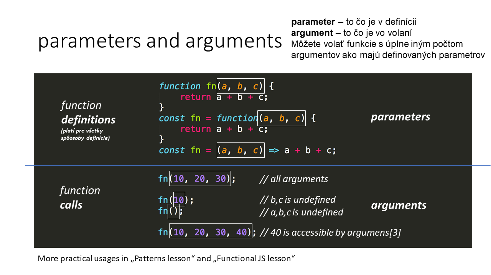
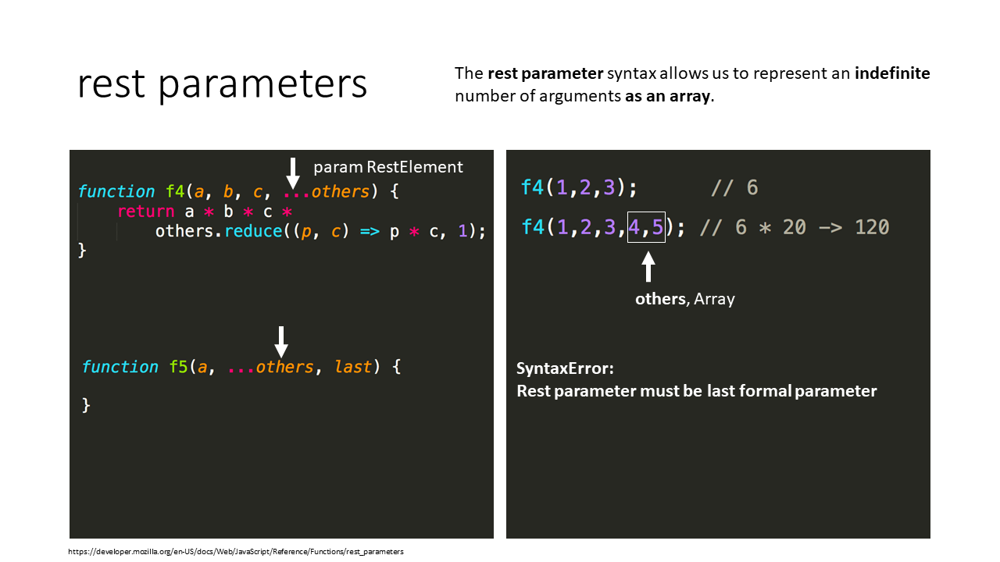
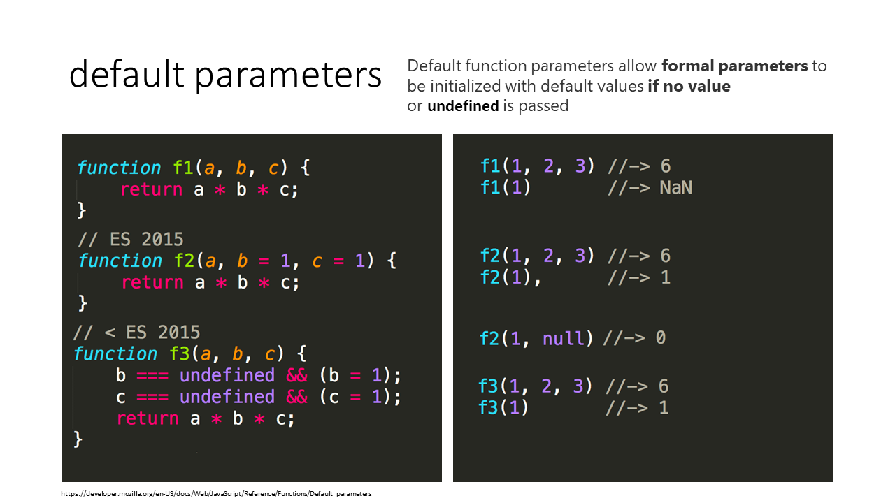
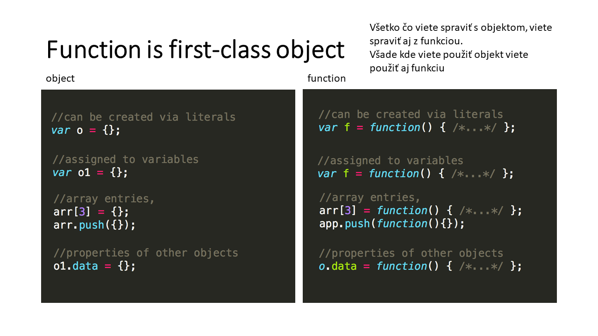
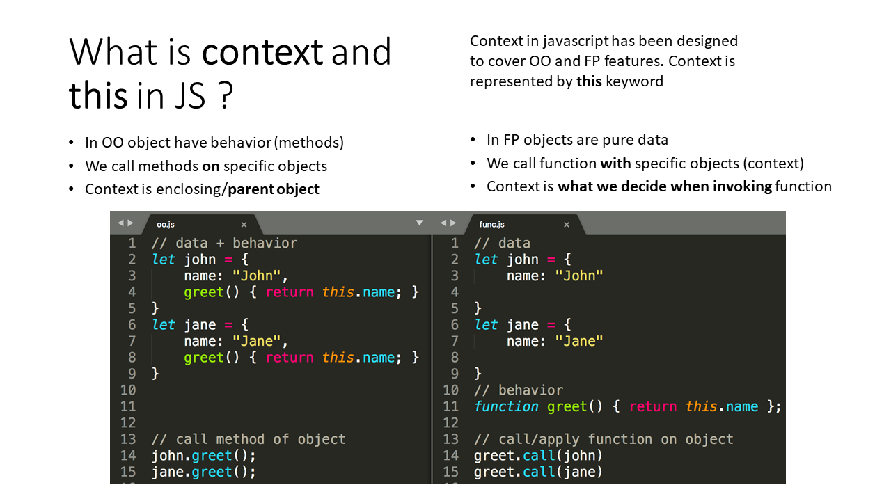
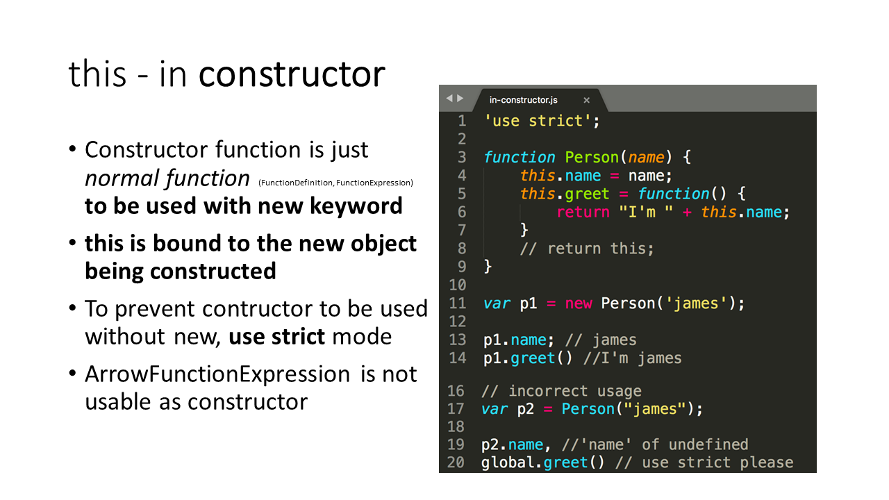
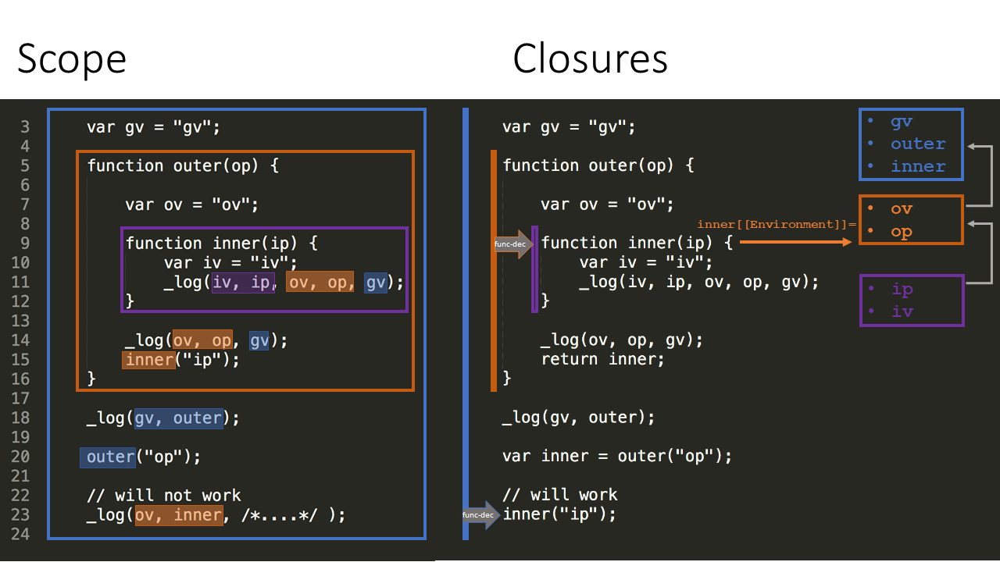

# Funkcie

- function expression
- function declaration
- arrow function

## Primary unit of execution
**run-to-completion** – whole function is executed (na stacu kym nedobehne).

## parametre, argumenty
- parameter
  - to čo je v definícii
  - optional
  - have no type
- argument
  - to čo je vo volaní funkcie 
  - special keyword

## rest parametre

## default parametre

## first class object
vsade kde sa da poslat objekt tam aj funkcia

## this

### this - in constructor

## scope a closures

- **scope**
  - ake premenne a funkcie „vidim“/“mam dostupne“ v danom kuse kodu
- **closure**
  - funkcia s odpamätanými premennými z okolia
- **Lexical Environment**
   - zoznam identifikátorov definovaných v danom scope a linka na outer scope environment

### closures

> fenomen JS, ze funkcia na tom mieste kde je zadefinovava, si uklada pointre.

# Na skúšku
- Uvedomiť si že JS funkcie sú asi iné ako poznáte z iných jazykov
- Rozoznať function declaration od function expression v kóde
- Vysvetliť pojem „function is first-class object“
- Poznať syntax arrow function a dokázať povedať čo funkcia vracia (v uvedenom príklade)
- Dokázať používať this a rozumieť, kedy má akú hodnotu podľa spôsobu definície a typu volania funkcie
- Určiť na príklade ktoré identifikátory sú dostupné pri volaní funkcie a vysvetliť prečo 
