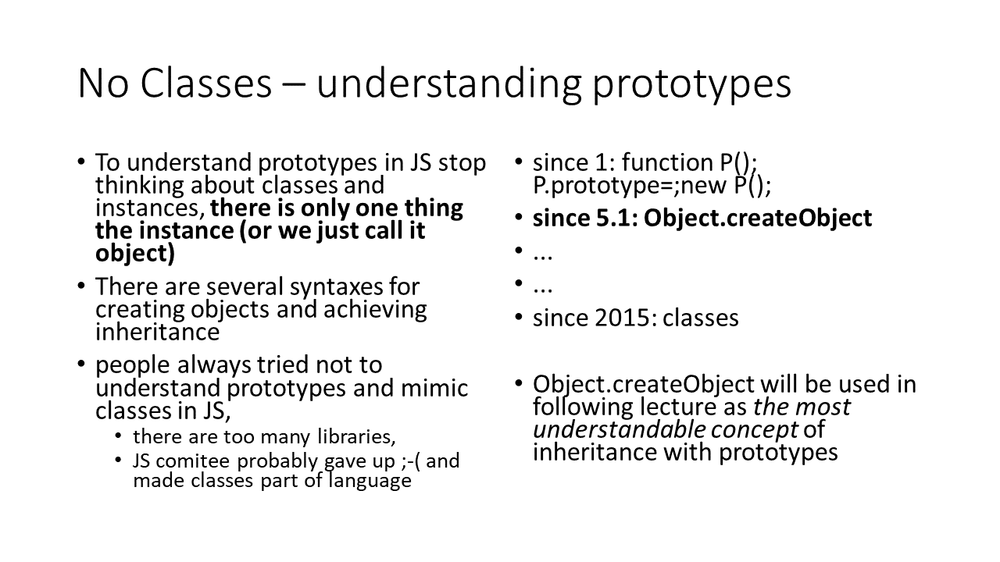
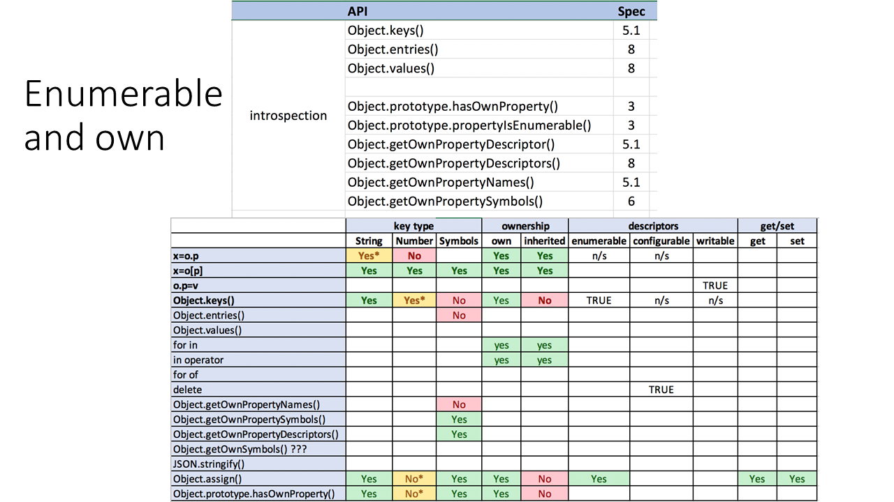

# Objekty
- JS *DOES NOT* have **classes** 
  - it is syntactic sugar over prototypes
- JS have **decorators** 
  - on those classes
- JS have **getters** and **setters**
  - on those classes, and on objects
- JS *DOES NOT* have **packages** or **namespaces**
  - we just simulate them with modules and returned objects
- JS *DOES NOT* have **aspects**
  - We just simulate them with functional concepts
- JS *DOES NOT* have **multiple class inheritance**
  - Do we really need this ? **in JS you don't need classes nor prototypes to create object**

## prototypes

    
> JavaScript objects are dynamic "bags" of properties (referred to as own properties). JavaScript objects have a link to a prototype object. When trying to access a property of an object, the property will not only be sought on the object but on the prototype of the object, the prototype of the prototype, and so on until either a property with a matching name is found or the end of the prototype chain is reached. (MDN)

## writable, enumerable, configurable
https://developer.mozilla.org/en-US/docs/Web/JavaScript/Enumerability_and_ownership_of_properties

## getters, setters

## symbols
- The data type "symbol" is a **primitive data type**
- This data type is used as the key for an object property when the property is intended to be **private, for the internal use** of a class or an object type
- When a symbol value is used as the identifier in a property assignment, the property (like the symbol) is anonymous; and also is **non-enumerable**. 
- non-emuberable means it will not show in for( ... in ...)", 
- anonymous, it will not show up in the result array of "Object.getOwnPropertyNames()". 

## Introspection
- What is enumerable and why it is important
- In computing, type introspection is the ability of a program to **examine the type or properties of an object at runtime**.

# Summary
- rozumieť dedeniu – poznať variácie zápisov pri konštrukcii objektov
  - {x:},o.y=
  - createObject
  - new MyFunction()
  - new MyClass()
- readonly properties
- dokázať rozlíšiť medzi own a not-own properties
- enumerable a non enumerable
- getter a setter
- dokazat povedat rozdiel medzi `if(x 'in' o)`, `if(o.x)`, `if(typeof o.x === 'undefined')`, ...
