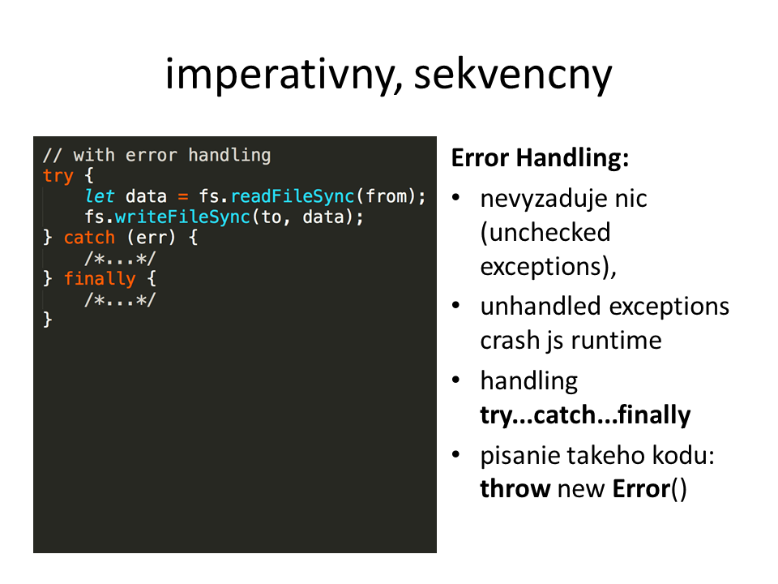
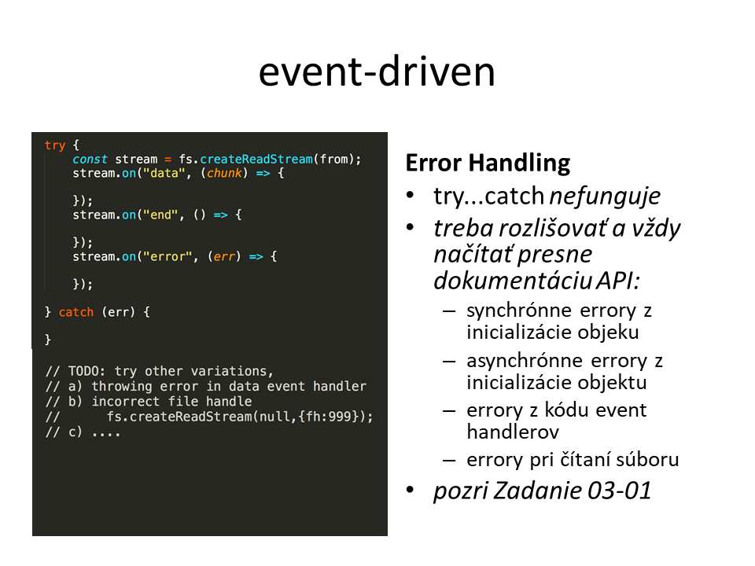
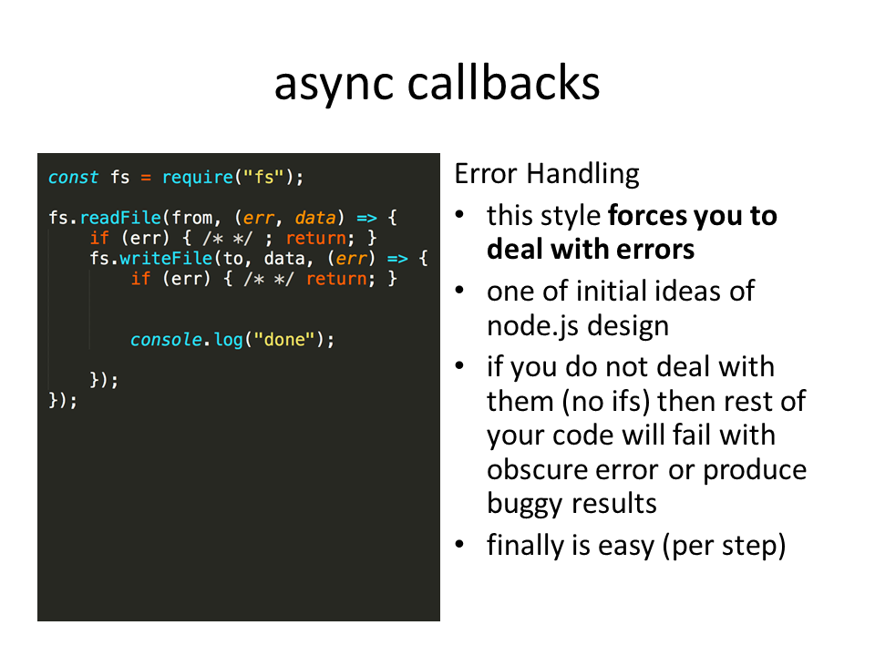
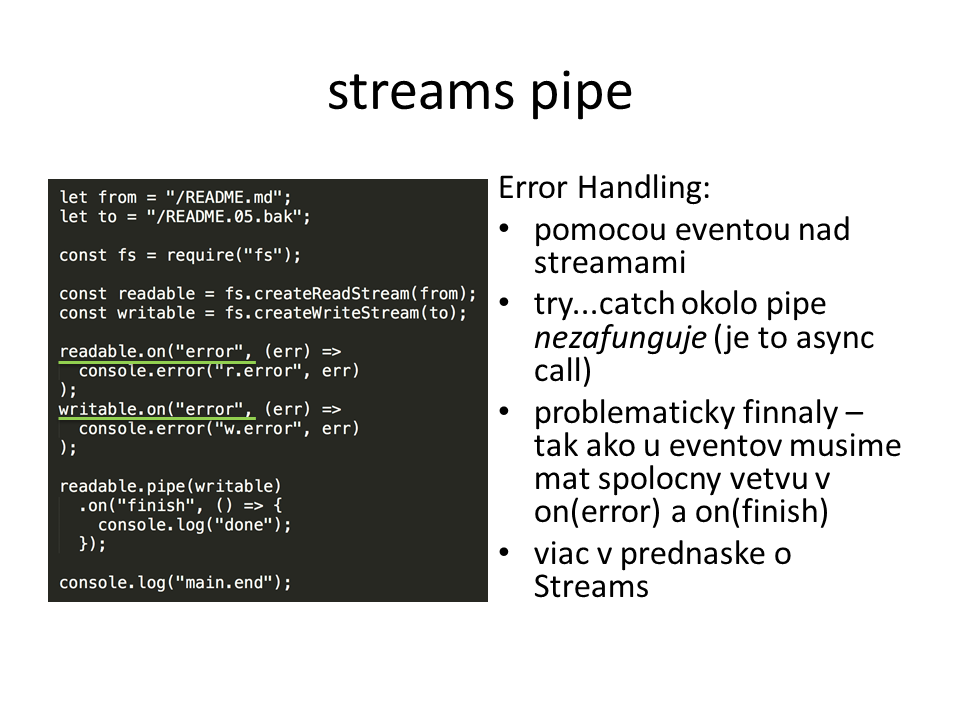
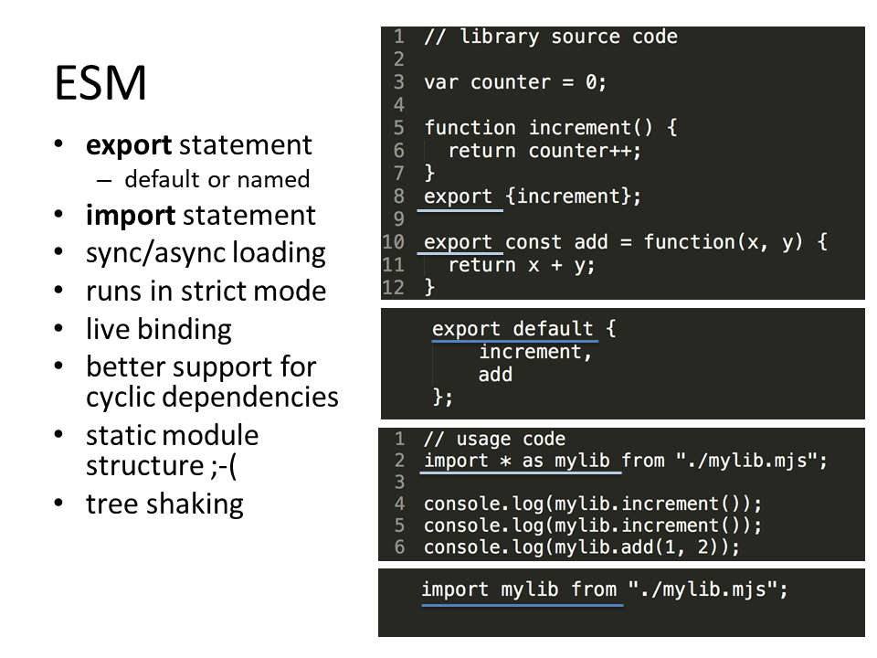
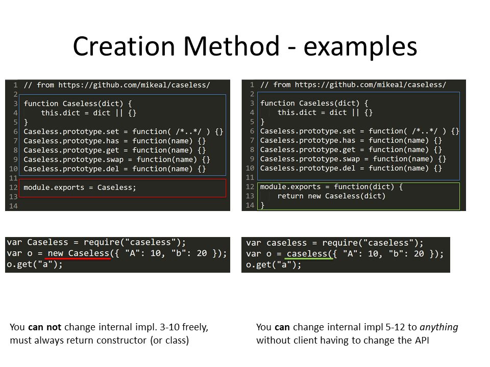
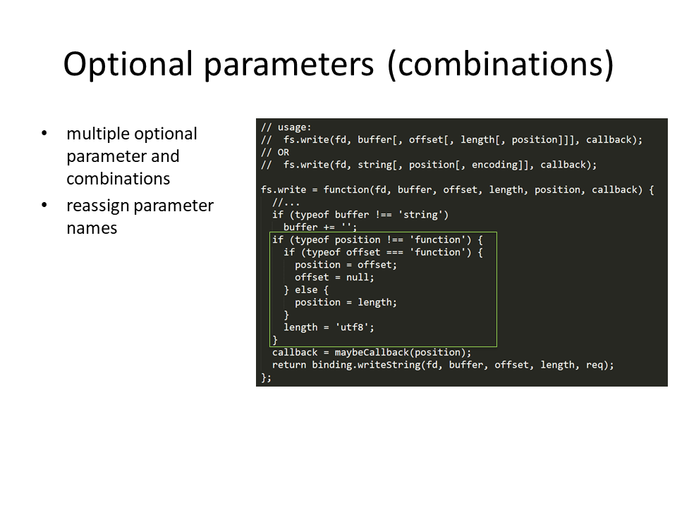
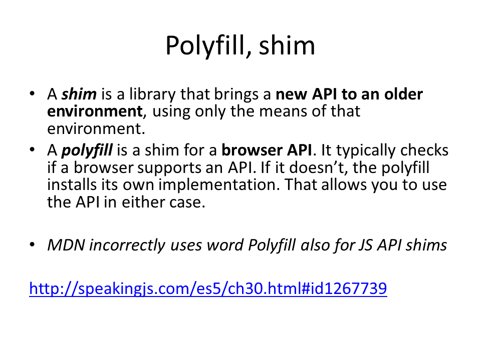

# Patterny
- imperativny, sekvencny
- event-driven
- async callbacks
- promises
- streams pipe

## error handling
### imperativny, sekvencny

### event-driven

### async callbacks

### promises

### streams pipe

## module pattern

- require / import
- export

## creation method pattern

## parametes

## polyfill, shim

