# Funkcionálne programovanie

## for cyklus, prepisat na map filter reduce...
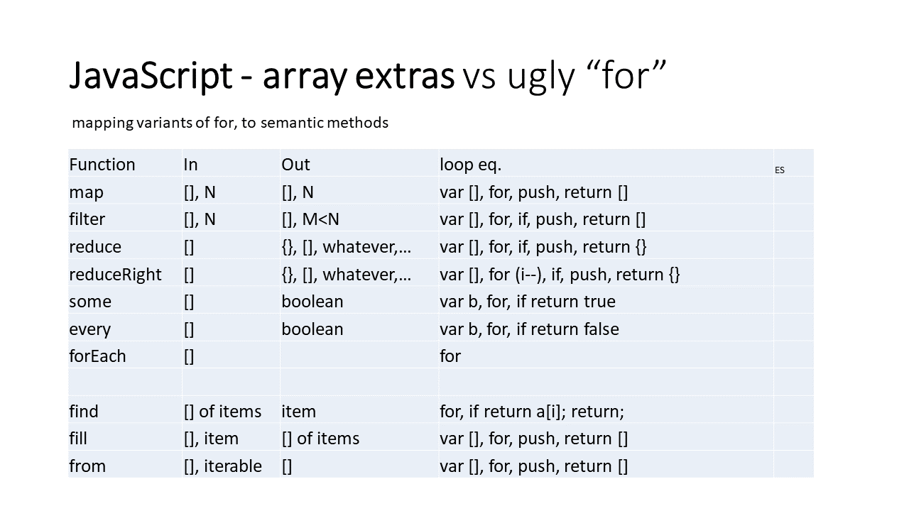

## pipe a compose (vediet rozdiel)
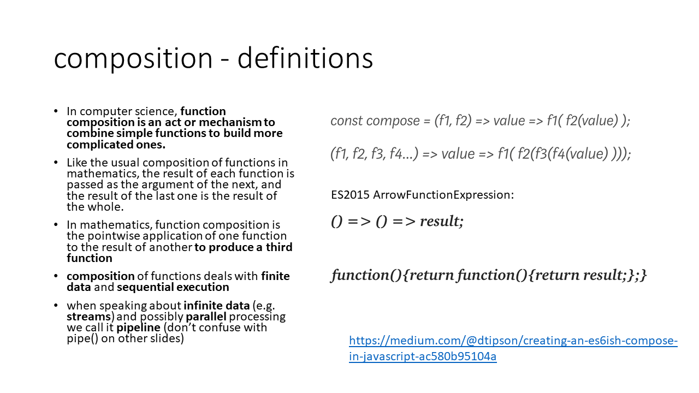

## ~~funkcie vs metody~~
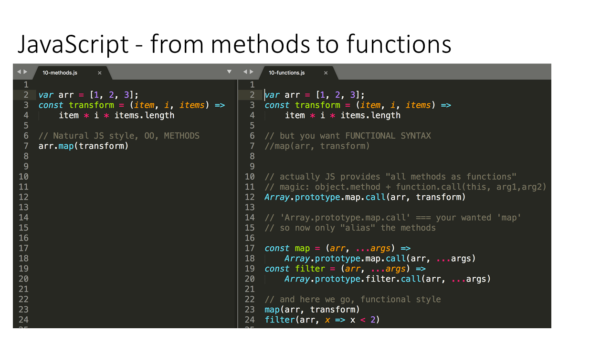
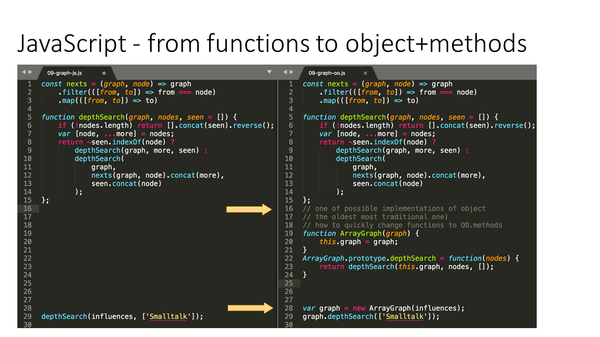

## pure functions

- **Referential transparency**: The function always gives the same return value for the same arguments. This means that the function cannot depend on any mutable state.
- **Side-effect free**: The function cannot cause any side effects. Side effects may include I/O (e.g., writing to the console or a log file), modifying a mutable object, reassigning a variable, etc.

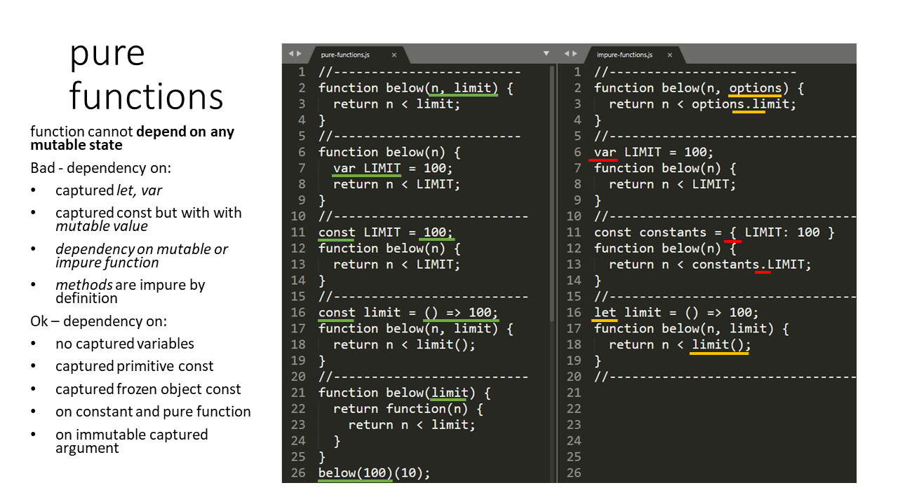

## high order functions
Higher order function is a function that does one of or both:
- takes a **function as an argument**
- returns **function**

### takes a **function as an argument**
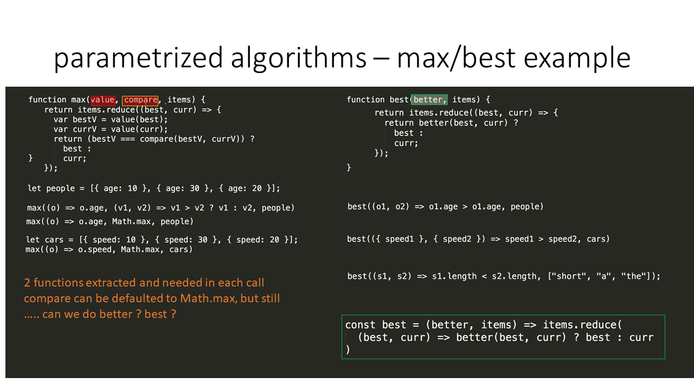

### returns **function**
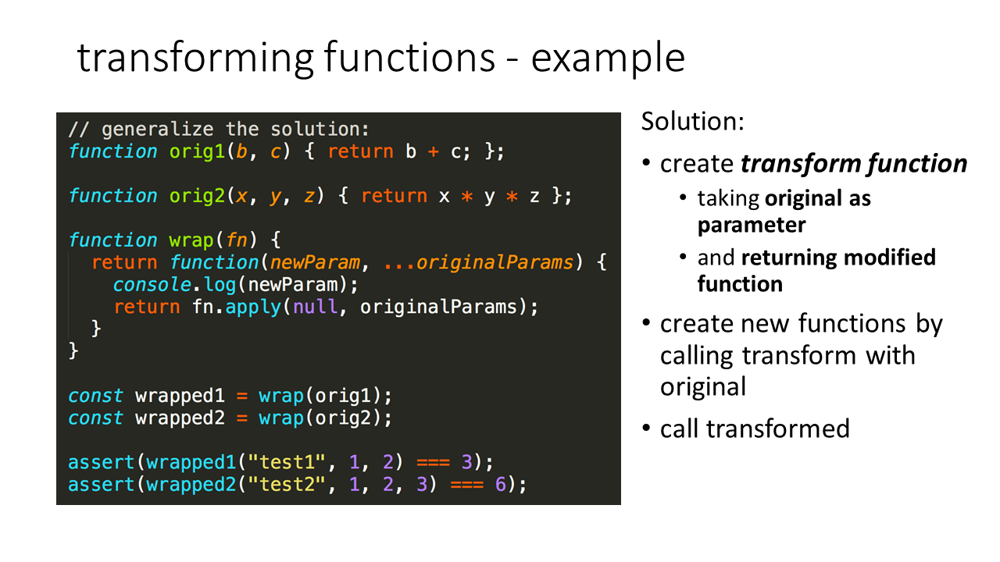

## transforming functions
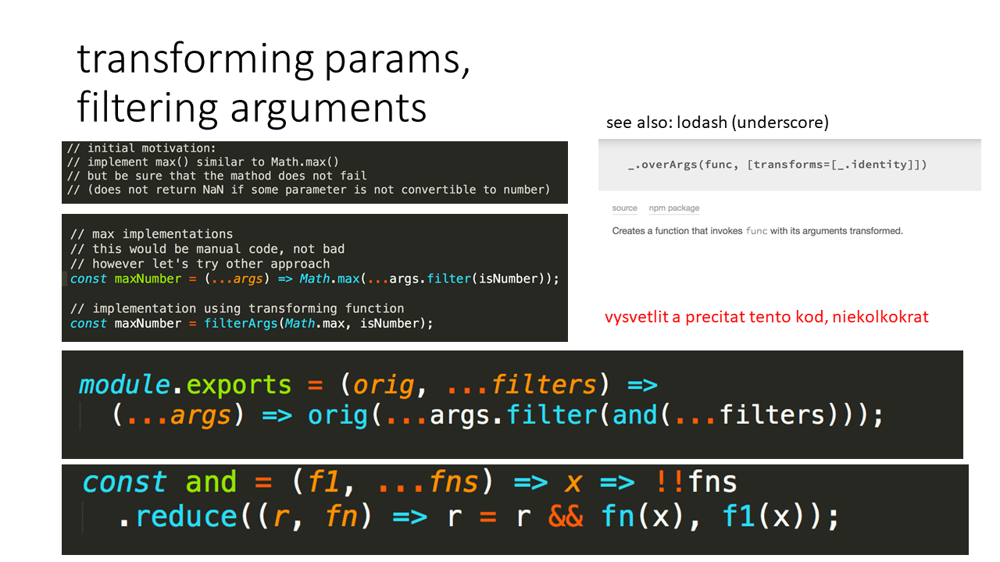

## immutability
By default things are **mutable** in JS. An **immutable object** is an object whose state cannot be modified after it is created. 

- **Shared state** is *fine* if it is immutable.
- **Mutable state** is *fine* if it is not shared.

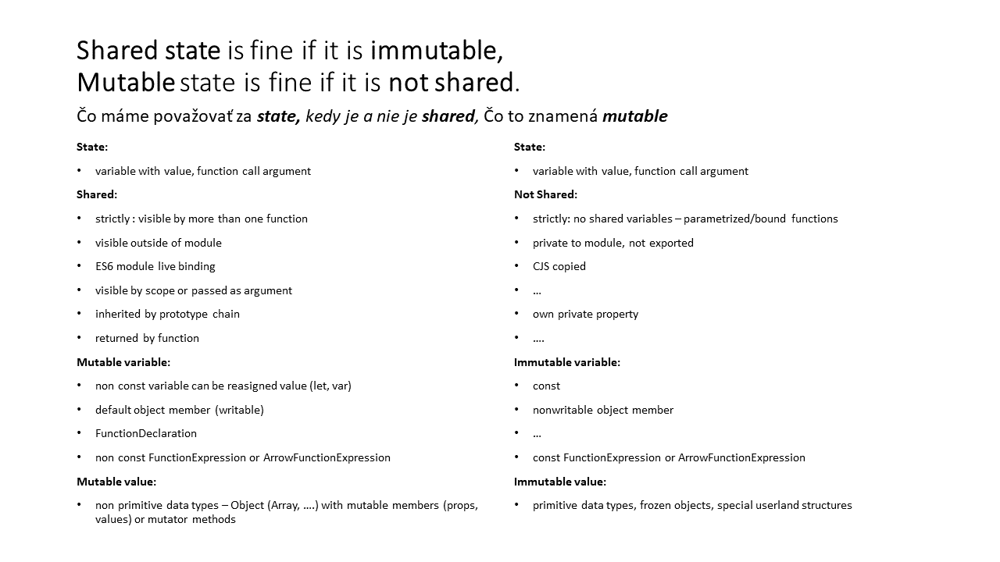

### How to acheive immutability?
frozen objects
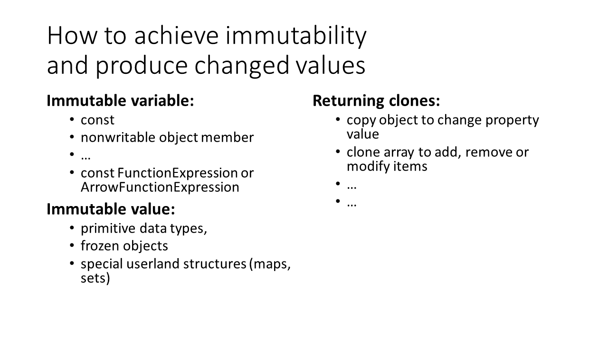

## map vracia novy array ale mutuje...
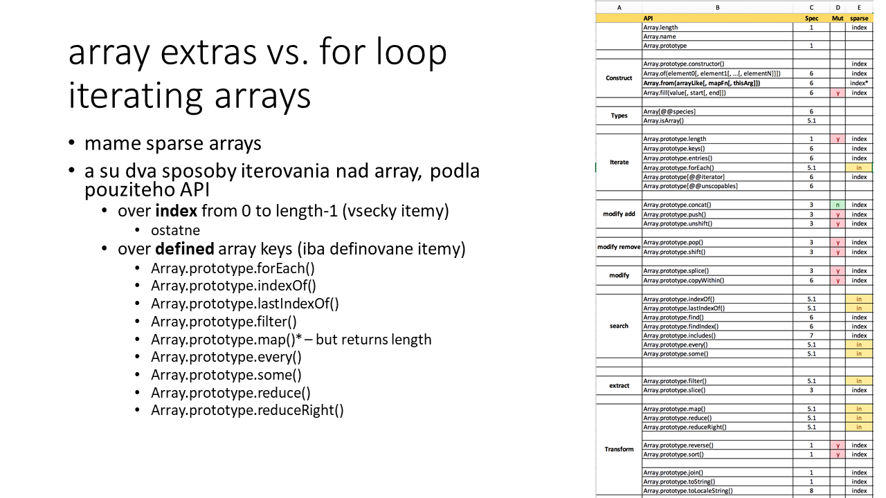

## object manipulation
- modify/add property
- remove/clear property
- whitelist/blacklist properties
- clone object (shallow/deep)
- merge objects (shallow/deep)
- traversing objects

### modify/add property
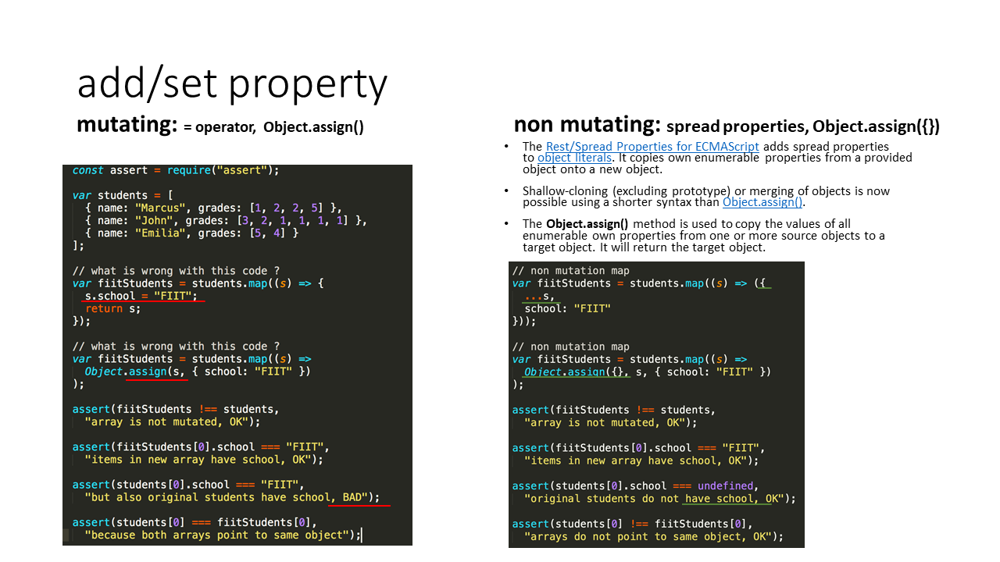

### remove/clear property
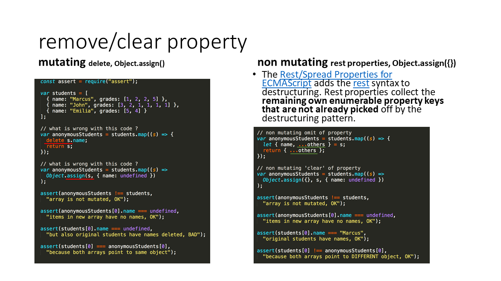

### whitelist/blacklist properties


### cloning
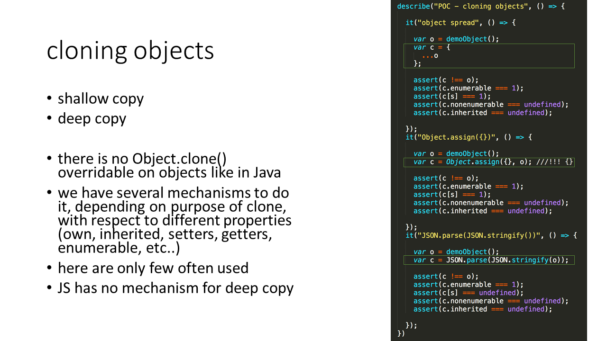
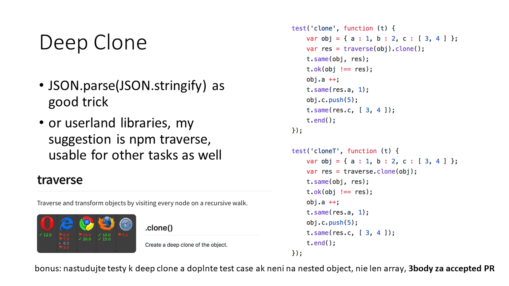

### traversal
ES has no traversal algorithms build in, except for:
- **JSON.parse**: post order
- **JSON.stringify**: pre order

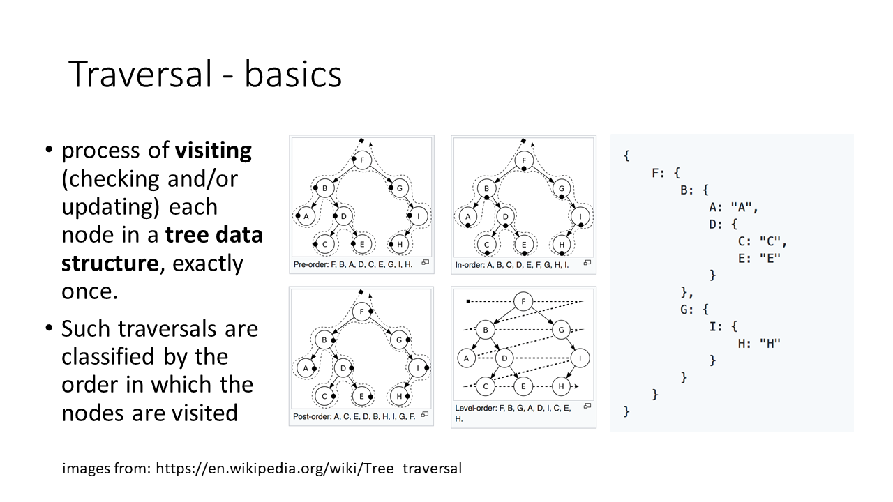

## rekurzia
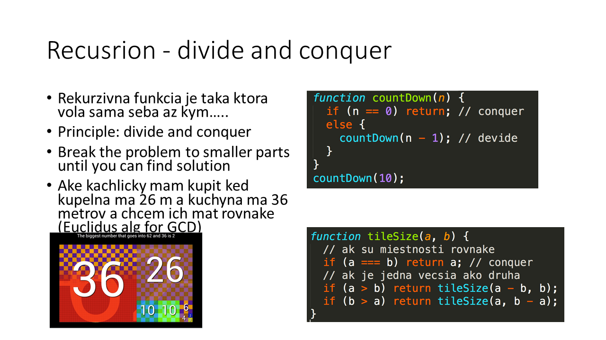
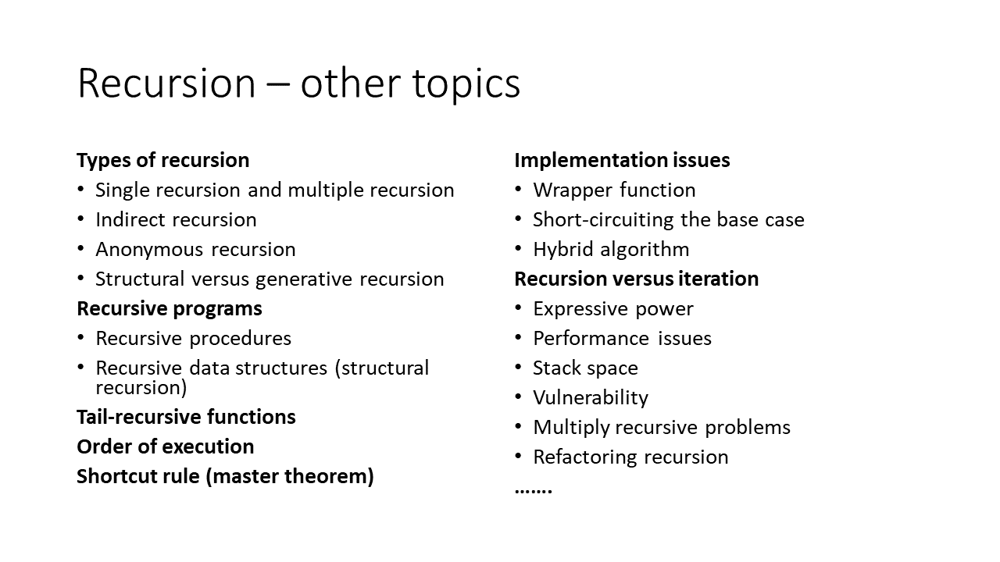

## partial function
> Partial application is the act of taking a function which takes multiple arguments, and “locking in” some of those arguments, producing a function which takes fewer arguments.

```js
>>> var add = function(a, b) { return a + b; };
>>> add(5, 4);
9
>>> var add5 = function(b) { return add(5, b); }
>>> add5(4)
9
```

## curried function
> A function that will return a new function until it receives all it's arguments.

```js
>>> var add = wu.autoCurry(function(a, b, c) { return a + b + c; });
>>> add(1)(1)(1)
3
>>> add(1)()(1)()(1)
3
>>> add(1)(1, 1)
3
>>> add(1, 1, 1)
3
```
### bind
ECMAScript 5 introduced `bind()` which brings (among other things) native currying to JavaScript. Once again, let’s take the add function.

```js
function add(a,b,c) {
    return a + b + c;
}
```

This is how you curry it using `bind()`.

```js
var intermediate = add.bind(undefined, 1, 2);
var result = intermediate(3);// 6
```

The first argument to `bind()` actually sets the infamous this context of the function. We can leave it undefined here, since it has no effect.
