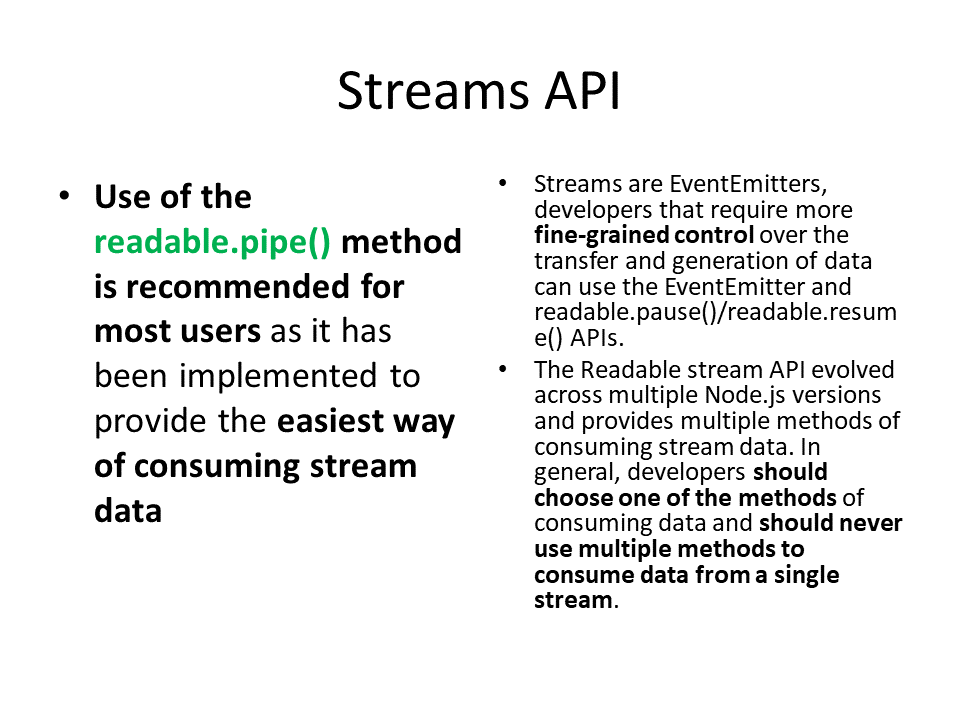
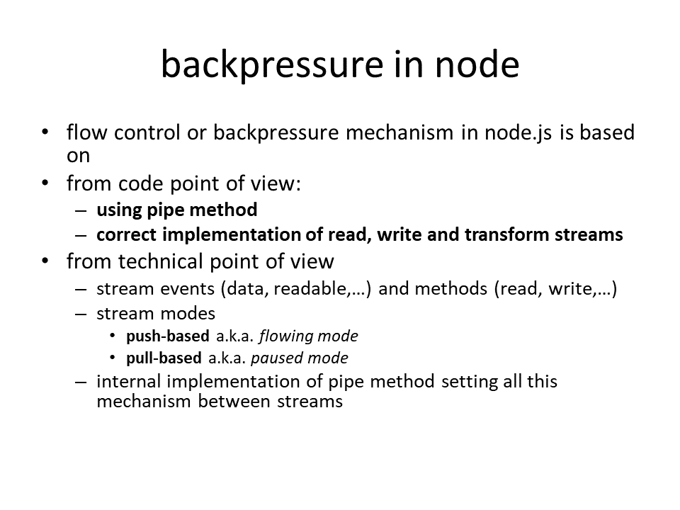
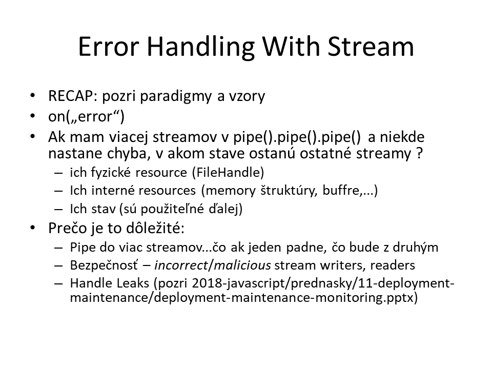
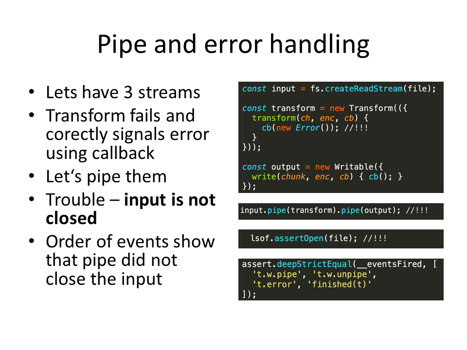
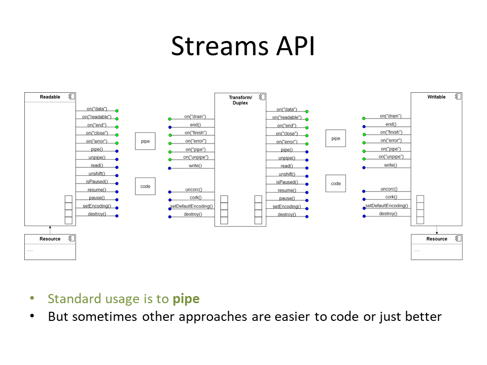
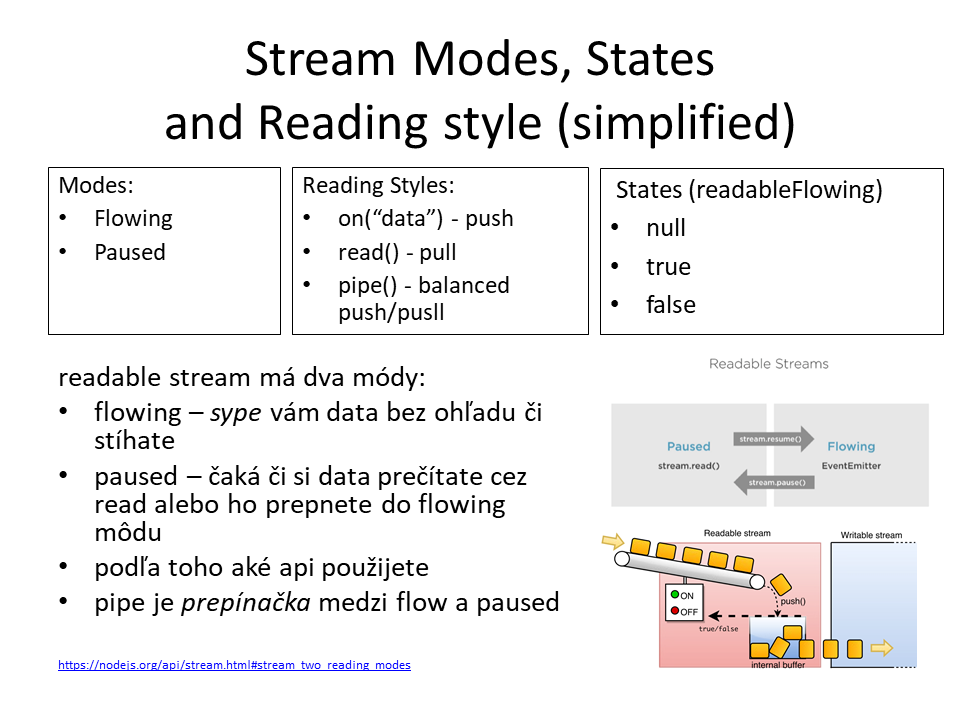
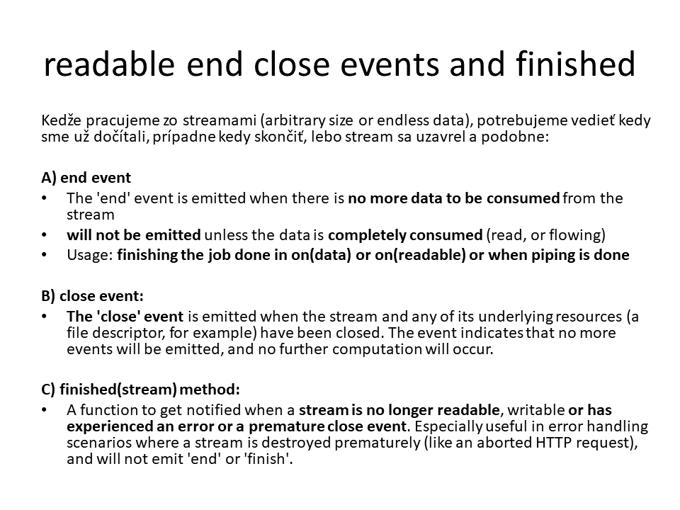
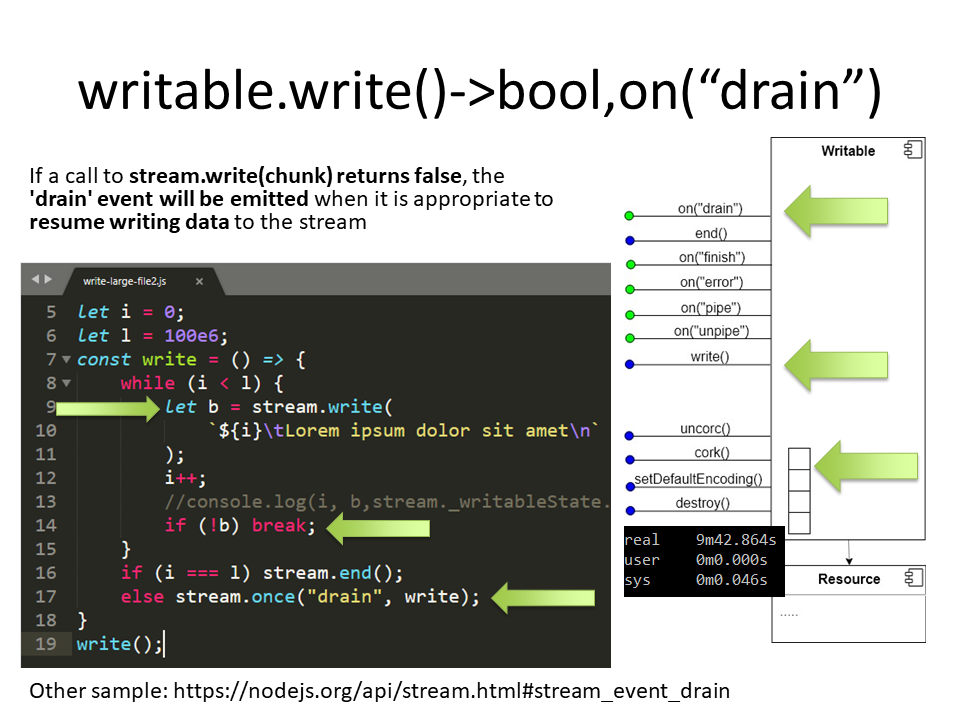
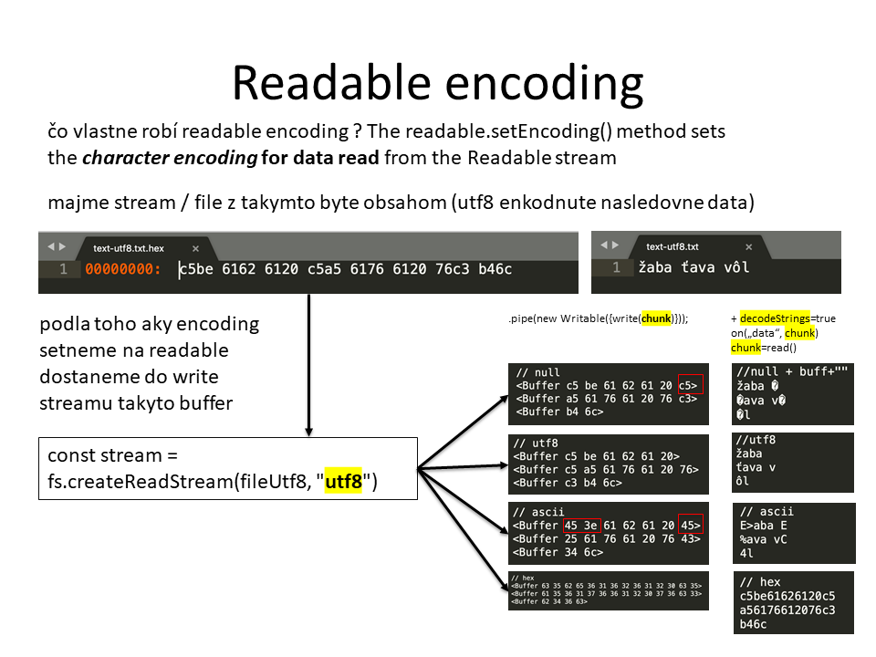
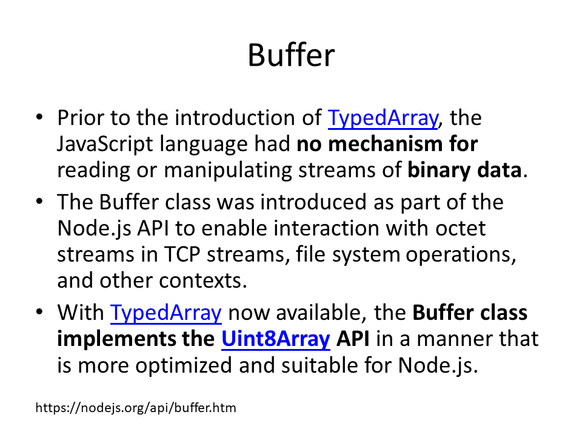

# Streamy
- Načo sú nám streamy a čo sú to streamy
- Čo to znamená programovať streamovo
- Aké streamy máme v node.js
- Ako fungujú streamy v node.js
  - Backpresure, buffering
- Ako používať/nepoužívať streamy
  - Čitanie
  - Zápis
  - Tranformácie
- Streams API vs. PIPE 

## Types of streams

## Pipe

### Backpressure

### Error handling

Akonahle pajpujeme 2 3 4 streamy, uz je tazky error handling. Ak nastane chyba, niektore mozno zostanu otvorene.
- halvna vyhoda metody pipeline je, ze v pripade chyby uzvare streamy.

### Object streams

## Streams API

### Readable

**Close event**

### Writable

### Encoding

## Buffer

### API

`buffer.slice`
- Returns a new Buffer that references the same memory as the original, but offset and cropped by the start and end indices.

