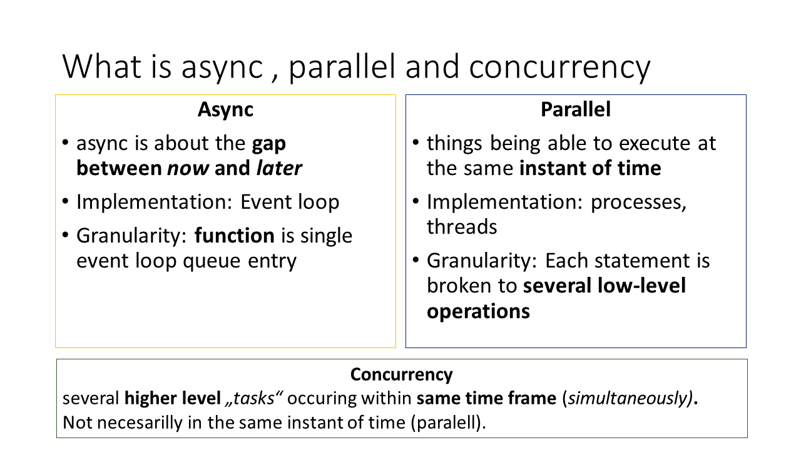
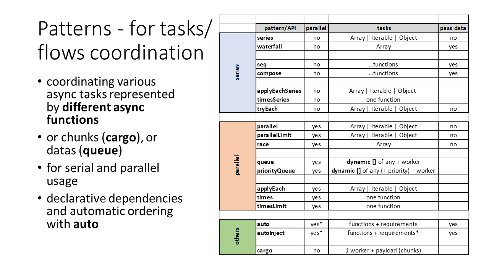
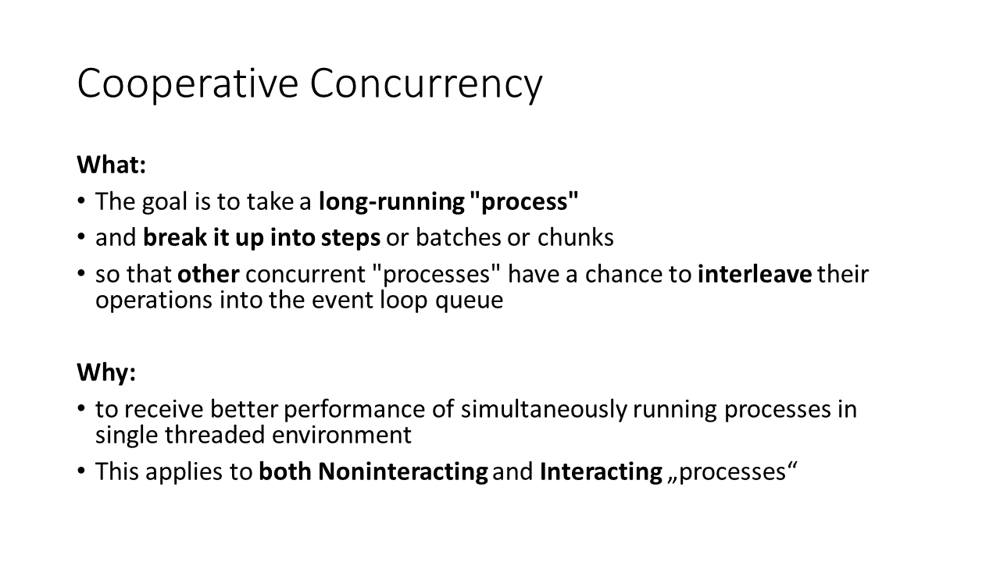
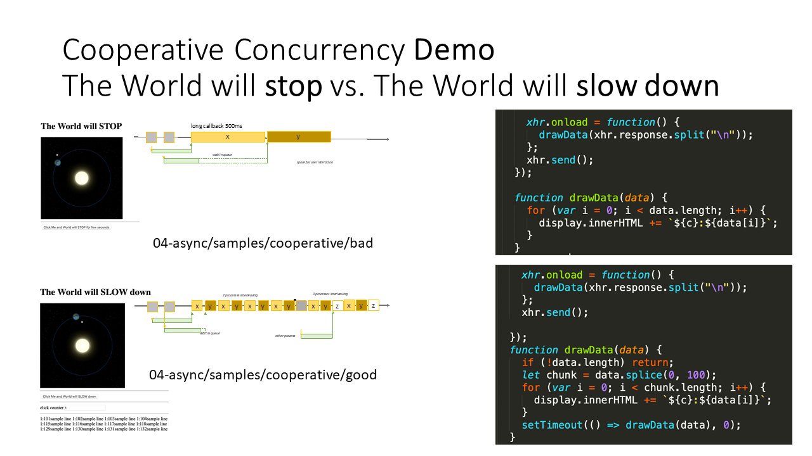
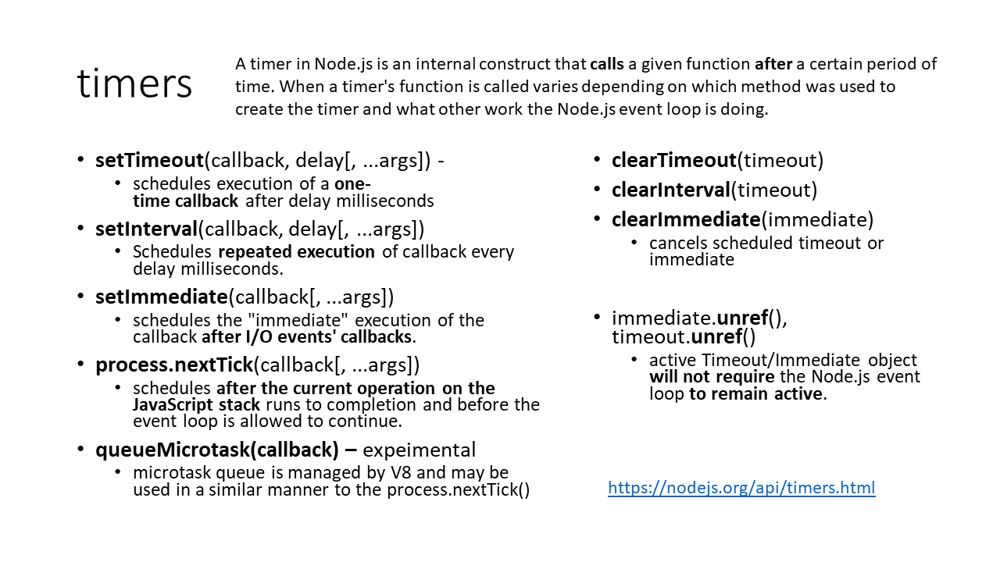

# Async


## Patterns


## Callback hell
Ku hlavných problémom programovania s callbackmi patrí:
- CB môže byť buď sync alebo async.
- CB sa moze zavolať viac krát alebo dokonca vôbec.
- CB pošle akékoľvek parametre chce.


## Cooperative concurrency




## Timers
- nextTick - immediate
- SetImmediate - after event loop



### Event loop
```
   ┌───────────────────────────┐
┌─>│           timers          │
│  └─────────────┬─────────────┘
│  ┌─────────────┴─────────────┐
│  │     pending callbacks     │
│  └─────────────┬─────────────┘
│  ┌─────────────┴─────────────┐
│  │       idle, prepare       │
│  └─────────────┬─────────────┘      ┌───────────────┐
│  ┌─────────────┴─────────────┐      │   incoming:   │
│  │           poll            │<─────┤  connections, │
│  └─────────────┬─────────────┘      │   data, etc.  │
│  ┌─────────────┴─────────────┐      └───────────────┘
│  │           check           │
│  └─────────────┬─────────────┘
│  ┌─────────────┴─────────────┐
└──┤      close callbacks      │
   └───────────────────────────┘
```


## Promies


### Chaining


### Error Handling


### Patterns

**All**


**Race**


## Await


